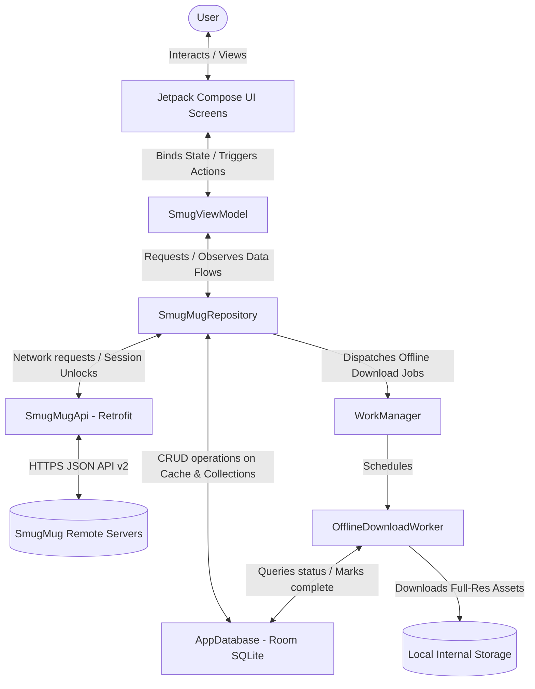

# SmugView Android App Development Plan

This document outlines the configurations, API details, architectural guidelines, customizations, and roadmap for building the **SmugView** Android application. The goal of this application is to browse a preconfigured public SmugMug site directly, support password-protected galleries securely, and provide advanced search/filtering (including inclusive/exclusive tag filtering), as well as a full-featured photo detail experience.

---

## 🛠️ Application Configuration & Settings

All project-specific configurations and customization values are tracked here.

| Configuration Key | Expected Value / Format | Purpose |
| :--- | :--- | :--- |
| **App Name** | `SmugView` | User-facing name of the Android application |
| **Package Name** | `com.smugview.app` | Unique identifier for the Android application |
| **SmugMug Nickname** | *Dynamic User Input* | User enters a public SmugMug nickname (e.g. `username`) or custom domain to explore |
| **SmugMug API Key** | *TBD (Developer API Key)* | Required to authenticate requests to the SmugMug API v2 |
| **Default Node ID** | *TBD (e.g., Root Node)* | Starting Node ID for the app, representing the root folder or a specific sub-folder |

> [!IMPORTANT]
> **API Key Setup**: To request a SmugMug API key, register your application on the [SmugMug Developer Portal](https://api.smugmug.com/api/developer/apply).
> Never hardcode the API Key in the source code. Instead, store it in `local.properties` or retrieve it at compile-time using the Secrets Gradle Plugin.

---

## 📡 SmugMug API v2 Integration (Public Access & Security)

Since this app uses **public access only**, OAuth 1.0a signatures are not required. We can access public resources simply by passing the `APIKey` query parameter.

### 1. Base URL & Client Configuration
All API requests must target the SmugMug API v2:
```
https://api.smugmug.com/api/v2
```
*   **Headers**:
    *   `Accept: application/json`
    *   `User-Agent: SmugView-Android-App/1.0`
*   **API Interceptor / Resiliency**:
    *   Implement exponential backoff retry mechanism in OkHttpClient for handling temporary network dropouts or `429 Too Many Requests` status codes.
    *   Intercept API `404 Not Found` for profile lookups to show an explicit "User Profile Not Found" error rather than a generic network error.

### 2. Pagination (Paging 3 Integration & Recursive Children Loading)
All lists (Nodes, Images, Search Results) in SmugMug are paginated.
*   **Pagination parameters**: Use `_config` (to retrieve metadata like total counts and pagination URLs) and limit parameters.
*   **Next Page**: The API responses contain a `Response.Pages.Next` URI string.
*   **Implementation**: 
    *   **Images & Search Results**: Use Android's `Paging 3` library. The network data layer uses `PagingSource` implementations that extract the `Next` URI from the JSON response and execute subsequent network calls using this URI.
    *   **Node Children (Folders/Albums)**: For full local directory caching, the repository pages through child nodes recursively. It initiates the request with a count of 100, then executes sequential `getNodeChildrenByUri` calls using `pages.next` URIs in a loop with a small 100ms pacing delay until all children are fetched and cached in the local Room SQLite database.

### 3. Key Endpoints

#### A. Fetch User Profile (Dynamic Lookup & Verification)
Retrieve public user profile details to verify the nickname entered in the explorer and locate their root node URI.
- **Endpoint**: `GET /api/v2/user/{nickname}`
- **Query Params**: `APIKey={api_key}`
- **Response path to Node**: `Response.User.Uris.Node` or `Response.User.Uris.Node.Uri`
- **Error Handling**: If the nickname is invalid or returns a `404`, show a clear "Site Not Found" inline error. To prevent transient typos from throwing user-facing error flyout popups (Toasts) during real-time typing validation, pass `X-Ignore-Errors: true` as an HTTP header to tell the client interceptor to silence/ignore these lookup errors.

#### B. Fetch Node Details (Folder / Album Structure)
Discover the children of a folder or album node.
- **Endpoint**: `GET /api/v2/node/{node_id}!children`
- **Query Params**: `APIKey={api_key}&_expand=HighlightImage`
- **Key Parameters**: Inspect `Access` and `PasswordHint` fields. If `Access` equals `"Password"`, flag the node as locked in the UI (showing a padlock icon) and prompt the user for input.

> [!IMPORTANT]
> The expansion parameter is `HighlightImage` (the folder/album cover thumbnail), **not** `Image`. `_expand=Image` does not exist as a valid SmugMug expansion on this endpoint and will be silently ignored by the server.

#### C. Fetch Album Images (Including Locked Albums)
Retrieve the list of images/videos inside a specific album node.
- **Endpoint**: `GET /api/v2/album/{album_key}!images`
- **Query Params**: `APIKey={api_key}&Password={password}` (include the password parameter if the album is password-protected)
- **Response Fields**:
  - `Title`: Image caption/title.
  - `ThumbnailUrl`: URL for the preview image.
  - `ArchivedUri`: Direct link to the full-size image file.
  - `Date`: Date when the photo was taken (useful for sorting).
  - `DateTime`: Date when the photo was uploaded.

#### D. Search User Content
The app uses two distinct image search endpoints:
- **Primary (scoped user search)**: `GET /api/v2/user/{nickname}!imagesearch`
  - **Query Params**: `APIKey={api_key}&Scope={gallery_node_uri}&Text={search_term}&Password={password}`
  - **Usage**: The main search path. Supports the `Scope` parameter to target specific galleries. Required for searching inside password-protected or unsearchable albums.
- **Secondary (global index search)**: `GET /api/v2/image!search`
  - **Query Params**: `APIKey={api_key}&Scope={user_node_uri}&Text={search_term}`
  - **Usage**: Returns photos from SmugMug's global search index. Does **not** return results from albums marked `"Searchable: No"` or password-protected albums, even if unlocked in the session.

> [!IMPORTANT]
> Do not confuse these two endpoints. `image!search` is a global cross-user index search. `user/{nickname}!imagesearch` is user-scoped and supports the `Password` parameter. The scoped endpoint is the correct one to use for the SmugView use case.

#### E. Fetch Image Metadata (EXIF)
- **Endpoint**: `GET /api/v2/image/{image_key}!metadata`
- **Query Params**: `APIKey={api_key}`

### 4. Case-Sensitive API Enums & Layout Values

To prevent parsing or comparison mismatches in the client application, all API response strings must be mapped or compared using their exact, case-sensitive formats returned by the SmugMug API v2.

#### A. GalleryStyle Enums
These determine the layout settings of a gallery. They are camelCase and do NOT contain spaces:
*   `"SmugMug"` - Classic view with thumbnail column and primary image preview.
*   `"Traditional"` - Grid-based standard navigation.
*   `"Journal"` - Storytelling layout with large images stacked vertically.
*   `"Thumbnails"` - Grid of small previews opening to lightboxes.
*   `"Slideshow"` - Automated carousel display.
*   `"FilmStrip"` - Horizontal preview strip below active image.
*   `"Squares"` - Uniform 1:1 square crop grid.
*   `"CollageLandscape"` - Staggered layout favoring landscape ratios.
*   `"CollagePortrait"` - Staggered layout favoring portrait ratios.

> [!IMPORTANT]
> The API returns these strings as camelCase (e.g. `"CollageLandscape"`, `"CollagePortrait"`). Any custom client checks must normalize these strings by stripping spaces and converting to lowercase to prevent matching failures (e.g. `style.lowercase().replace(" ", "")`).

#### B. Node Type Enums
*   `"Folder"` - Structuring container node.
*   `"Album"` - Gallery container node.
*   `"Page"` - Custom web page.

#### C. SecurityType / Access Enums
*   `"Public"` - Viewable by everyone.
*   `"Private"` - Owner-only access.
*   `"Password"` - Requires entry of correct passcode validation.
*   `"Unlisted"` - Accessible only via direct URL.

---

## 🔍 Search & Advanced Tag Filtering Logic

The app must provide a multi-type search and a robust tag-based exclusion/inclusion filtering system:

### 1. Multi-Type Search
The search interface must query folders, galleries, and photos simultaneously, presenting results in categorized lists:
*   **Folders**: Local or API matches for folder names.
*   **Galleries/Albums**: Local or API matches for album titles.
*   **Photos**: Results returned by `/api/v2/image!search` with the scope constrained to the selected user.

> [!IMPORTANT]
> **Sequential Search-Cache Constraint**: To prevent race conditions, the remote gallery search must complete and write results to the local database *before* executing the scoped photo search. If run concurrently, the database query checks local cached directories before the API results are saved, returning 0 image results for unsearchable albums.

*   **Parent Gallery Key Resolution**: Because photos fetched via global search (`image!search`) do not return a direct parent gallery key, the app resolves it by:
    1. Parsing the folder/gallery URL slug segment from the photo's `thumbnailUrl` or `webUri`.
    2. Matching the segment against the local database cache of all visited nodes (`getAllCachedNodes()`).
    3. If the gallery is public, injecting the resolved album key path into `uris.album` to enable navigation.
    4. If the gallery is password-protected, automatically attempting to unlock the gallery using saved passwords in `passwordPrefs` before fetching metadata.


### 2. Interactive Tag Filtering Bottom-Sheet
A bottom sheet swipable UI displays all available keywords/tags from the active folder/album:
*   **Triple-State Tags**: Each tag chip can be cycled through three states:
    1.  **Neutral** (Default - grey chip, no effect).
    2.  **Include** (Tap once - glowing blue chip, photo must contain this tag).
    3.  **Exclude** (Tap twice - soft red chip, photo must not contain this tag).
*   **Clear All Option**: A prominent button to reset all tags to neutral.
*   **Empty State Handler**: If filters result in zero matches, show an informative illustration stating "No photos match your current tag combination" with a direct button to reset filters.

### 3. Local In-Memory Filtering Formula
Because the SmugMug API doesn't support complex logical operations (AND/OR/NOT) directly in queries, filtering is computed in the client-side domain layer using Kotlin Flows:
$$\text{visible} = (\text{includedTags.isEmpty()} \lor \text{photo.keywords.intersects(includedTags)}) \land (\text{excludedTags.isEmpty()} \lor \text{photo.keywords.disjoint(excludedTags)})$$

---

## 🔔 Folder & Gallery Update Indicators

Folders and galleries the site owner has recently updated show a small glowing cyan dot so
returning visitors can spot what's new without re-browsing everything.

*   **What counts as "updated"**: only `Album` nodes carry the raw signal — a folder is never
    directly "modified," so folders are excluded from the base case and instead inherit the dot
    by bubbling it up from any updated album underneath them. An album counts as updated when its
    `dateModified` (from the SmugMug API) is both (a) within the last 30 days, and (b) newer than
    the last time *this device* recorded the user viewing it.
*   **Data model**: `CachedNode`/`CachedAlbum` carry `dateModified` (`Entities.kt`); a
    `viewed_gallery_updates` table records, per node, the `dateModified` value that was current the
    last time the user viewed it. Comparing the two — rather than storing a boolean "seen" flag —
    means a *new* update after a visit correctly re-triggers the dot instead of staying silently
    cleared forever.
*   **Bubbling query**: `CollectionDao.getNodesWithActiveUpdates()` is a single recursive CTE that
    computes updated albums and walks the tree upward so every ancestor folder also lights up,
    letting a user spot a new gallery from the root without drilling down blind.
*   **Clearing**: `SmugMugRepository.markNodeAsViewed(nodeId)` records the current
    `dateModified` for that node *and* recursively for every descendant, so marking a folder viewed
    clears every album inside it in one action. This fires automatically when a gallery is opened,
    and manually via a long-press "Mark as Viewed" option on any grid card.
*   **Rendering**: a 10dp filled cyan circle (`Color(0xFF00F0FF)`) in the card's top-left corner
    (`BrowserScreen.kt`); cards without an update reserve the same 10dp of space with an invisible
    spacer so the badge appearing/disappearing never shifts the grid layout (CLS prevention, per
    the UX Designer persona's skeleton-loader/layout-shift rules elsewhere in this doc).

### Cache reconciliation: `cached_nodes` (tree) vs. `cached_albums` (flat index)

These are two independent Room tables covering overlapping data, and nothing keeps them in sync
automatically — every place that writes to one must explicitly decide whether the other needs
updating too:

*   **`cached_nodes`** is the browsable folder tree (`FoldersTabView`), populated per-folder by
    `getNodeChildren` on demand. It has **no staleness check**: once a folder's children are
    cached, they're served from Room forever until an explicit `forceRefresh = true` (e.g. a
    pull-to-refresh, or the unlock re-fetch above). `startFolderTreeSync`'s background crawl always
    passes `forceRefresh = false`, so it re-reads the existing cache, not the server — it does not
    by itself keep folders fresh.
*   **`cached_albums`** is the flat gallery index gallery *search* reads exclusively
    (`SearchController` never queries `cached_nodes` for galleries). It's synced by
    `buildInMemoryGalleryCache` at site load/switch via the incremental `LastUpdated` delta
    described above.
*   **The reconciliation**: `getNodeChildren` merges any Album-type children it fetches into
    `cached_albums` too (`mergeAlbumsIntoIndex`), so anything browsable is also searchable. And
    `buildInMemoryGalleryCache`'s delta sync — since it already knows exactly which galleries are
    new or changed, via `CachedAlbum.parentNodeId` — evicts just those galleries' parent folders'
    `cached_nodes` rows, so the next time that folder is opened it re-fetches fresh content instead
    of serving a listing that predates the change.

### Waiting on in-flight background writers before reading the cache

Merging data into these caches correctly (above) isn't enough on its own — a foreground read that
runs *while* a background writer is still mid-write can still observe (and worse, permanently
cache) an incomplete snapshot. Two `StateFlow<Boolean>` signals on `SmugMugRepository` exist so a
read path can wait instead of racing:

*   **`isAlbumsCacheLoaded`** — true once `buildInMemoryGalleryCache`'s initial sync has published
    at least one snapshot of `albumsCache`.
*   **`isIndexingSubtree`** — true while any `unlockAndIndexSubtree` walk (the background subtree
    indexer described above) is actively running. Backed by a counter, not a plain boolean, since
    unlocking two folders back-to-back means two overlapping walks — the flag must stay true until
    the *last* one finishes, not the first.

`SearchController.performSearch` awaits both before reading `albumsCache.value` for gallery
matching. Without the second one specifically: searching right after unlocking a folder could read
the cache mid-write, matching only whatever galleries the background walk had reached so far, and
then — since `performSearch` marks a query "fully searched" for 24h once it completes — silently
cache that incomplete result as trustworthy until the cache expired or the user forced a refresh.
**If you add a new background writer to either cache, ask whether any read path needs to wait on
it the same way**, rather than assuming "it'll usually have finished by the time anyone looks."

**Only the part that actually depends on the cache should wait.** The first version of this fix
made `performSearch` wait on both flags before doing *anything*, which also delayed photo search —
even though photos come from a live, paged API call (`performBackgroundSearchImages`,
`getPagedSearchPhotos`) that never touches `albumsCache`/`cached_nodes` at all. Since the UI
(`SearchTabView.kt`) gates its entire results shell — tabs, Photos content included — behind
`SearchUiState.Success`, that meant unlocking a folder and searching could leave the whole search
screen on a spinner, photos included, for as long as background indexing took. Fixed by reordering
`performSearch`: photos (Pager + background fetch) are wired up and `_searchState` flips to
`Success` (with galleries/folders initially empty) immediately, so the UI shell renders and the
Photos tab starts populating right away; the cache wait only gates the later `_searchState` update
that fills in the real galleries/folders once it clears. **When adding a wait like this, scope it
to the specific read that needs it — don't reach for "block the whole function" just because
that's the easiest place to put it.**

**A wait that eventually resolves can still look completely broken if nothing tells the user it's
still working.** Verified live on-device: the `unlockAndIndexSubtree` wait can take 18+ seconds on
a real site with several sub-folders. Once photos (decoupled, per above) start arriving before that
finishes, `SearchUiState.Success` has real photos but `galleries = []`/`folders = []` — structurally
identical to "search found nothing." `SearchController.isGalleriesFoldersLoading` (a
`StateFlow<Boolean>`, mirroring the existing `isSearchPhotosLoading`) exists specifically so
`SearchTabView.kt` can tell these apart: the Galleries/Folders tab labels show `(…)` instead of
`(0)`, and their content areas show a spinner + "Loading galleries/folders..." instead of "No
galleries/folders found," for as long as this is true. **Any time a wait is added between "show
empty state" and "show real state," check whether that gap needs its own loading signal** — an
empty list and a not-yet-populated list look the same in the data, but must not look the same to
the user.

---

## 📡 Casting & the Web Companion Server

SmugView can push the photo currently being viewed to a Chromecast, Roku, or Amazon Fire TV device
on the same local network. **None of this is SmugMug API traffic** — see the scope note at the top
of [SMUGMUG.md](SMUGMUG.md).

*   **Chromecast**: uses Google's standard Cast framework (`play-services-cast-framework`).
    `CastOptionsProvider` registers the receiver app; `CastManager` handles discovery/session
    lifecycle; `CastControllerScreen` + `CastButton` + `CastDeviceSelectorBottomSheet` provide the
    UI (play/pause slideshow, next/prev, volume, mute).
*   **Roku (ECP) & Fire TV (DIAL)**: these platforms don't speak Google Cast, so SmugView runs its
    own tiny local HTTP server — the **Web Companion** (`WebCompanionServer.kt`) — on port `8080`.
    It serves the currently-cast photo (and a small JSON feed for slideshow state) to the TV device
    over plain HTTP.
*   **Security scoping**: the Web Companion server is **only reachable by the specific device
    being cast to** — it validates the caller's IP against the allow-listed cast-target IP set when
    a cast session starts, not open to the whole LAN.
*   **Why `usesCleartextTraffic="true"` in the manifest**: this local casting traffic is plain HTTP
    by necessity (Roku ECP and Amazon DIAL are unencrypted local-network protocols). This is
    strictly scoped to LAN casting — all SmugMug API traffic is HTTPS via Retrofit's `baseUrl`
    regardless of this manifest flag. A network-security-config can't narrow this further because
    it can't match private-IP CIDR ranges, only hostnames/IP literals.
*   **`CHANGE_WIFI_MULTICAST_STATE` permission** is required for Roku/Fire TV discovery (SSDP/DIAL
    both rely on multicast).

---

## 🖼️ Photo Detail Actions & Offline Collections

When a photo is viewed in detail/full-screen mode, the application must offer the following features:

### 1. Immersive Full-Screen Viewer
*   **Visual Design**: A pure black backdrop with translucent floating navigation and utility buttons.
*   **Swipe Gestures**: Implements a smooth, gesture-driven pager (using Compose `HorizontalPager`) to swipe between photos, accompanied by subtle page-slide animations.
*   **Quick Actions**: Double-tapping the image triggers a scale-animated heart to automatically add the photo to the "Favorites" collection. Long-pressing the image reveals a quick-info overlay.
*   **Pinch-to-Zoom with Progressive High-Res** (`ImmersivePhotoPage` in `PhotoDetailComponents.kt`, shared by all three detail screens): pinch/drag scales the current photo from 1x–5x via `rememberTransformableState`. Pan is only consumed by the photo while zoomed in (`canPan = { scale > 1f }`) — at 1x, the same drag gesture falls through to the enclosing pager, so swiping to the next photo still works. Zoom resets to 1x whenever the page stops being the active pager page, so leaving a zoomed photo snaps it back. The base image shown is a mid-resolution rewrite of the thumbnail URL; once the user actually zooms in, a second, much larger image (`~2560px`, or the full `ArchivedUri`) loads in the background and crossfades over the lower-res image when ready — so the initial page load stays fast, and full detail only downloads if someone zooms in to look for it.
    > [!IMPORTANT]
    > Any new full-screen photo surface must reuse `PhotoDetailComponents.kt` rather than re-implementing zoom/pager interaction — a prior refactor (`1ecad32`) already consolidated this logic out of three near-duplicate screens specifically to avoid this drifting out of sync again.

### 2. Save to Device
*   Downloads the original high-resolution image (using the `ArchivedUri` or highest available size link) to **Pictures/SmugView** through MediaStore. Android 10 and later need no permission; Android 8 and 9 ask for the storage permission first, and a refusal says what it is for and how to change it.
*   The result is one line in the app's words (`DOWNLOAD_SAVED`, `DOWNLOAD_OFFLINE`, `DOWNLOAD_PERMISSION`, `DOWNLOAD_NO_SPACE`, or the failure cause), never a raw exception text. Offline means `SmugMugErrorMapper.isOffline`; a 429 or 5xx is not "you're offline".
*   **Filename Decoding & Sanitization**: Prior to saving, the image resource name must be decoded using `java.net.URLDecoder.decode(segment, "UTF-8")` to handle special URI characters properly, followed by stripping extension suffixes and replacing OS-illegal file characters (e.g. `\ / : * ? " < > |`) with underscores to ensure compatibility with local storage providers.

### 3. Share Photo Link
*   The Share button opens one dialog (`QrShareDialog`): a QR code of the photo's SmugMug web page with the caption "Opens the SmugMug page. Password galleries ask for their password there." (`SHARE_CAPTION`), and two buttons. **Share link** sends that page (`WebUri`, else the gallery's `WebUri` + `/i-{ImageKey}`; see SMUGMUG.md L6). **Share picture** sends the large rendition as a file, with camera details and location removed (`JpegStrip`; SMUGMUG.md L7 says why), under the small print `SHARE_STRIPPED`, with a "Preparing the picture…" toast and a cause-named toast if it fails (`shareFailed`). With no link the dialog says `SHARE_NO_LINK` and shows no QR. Both buttons go through `Intent.ACTION_SEND`. The QR never encodes a file path.

### 4. Detailed Metadata Viewer
*   Shows a bottom sheet displaying complete EXIF metadata fetched from `/api/v2/image/{image_key}!metadata` (Camera, exposure settings, shutter speed, aperture, ISO, and keywords).

### 5. Custom App-Local Collections & Saved (Offline) Files
*(Rewritten in Phase 5 step 5-10 to describe what exists. The earlier text promised an offline icon and a low-storage notification; neither was ever built.)*

*   **Room Database**: Collections (`offline_collections`), their photos (`collection_photos`) and bookmarks (`collection_bookmarks`) are persisted in Room. A bookmark of type Image wants its file; a Folder or gallery bookmark is only a shortcut.
*   **One owner of the files**: `OfflineStore` owns `filesDir/offline/{imageKey}.orig.{ext}` and the `offline_files` table (state PENDING, DOWNLOADING, DONE or FAILED, with a failure reason). Whether a file is still wanted is a query over `collection_photos`, Image bookmarks and a kept gallery's items (`offline_gallery_items`); the pass deletes files nothing wants. `OfflineCollections` is the write facade (save, bookmark, remove, delete a collection, keep a gallery); `OfflineReader` is the read side the screens use. Files are in app-private storage and excluded from backup.
*   **Keep offline (galleries)**: a Switch on a gallery shortcut inside a collection. The gallery is listed (every page, by `start`), then each photo is saved like any other. One global rule (`OfflineSettings`, the settings button on the Collections top bar, or "Change network setting" on a waiting gallery) says whether kept galleries save on Wi-Fi only (the default) or on Wi-Fi or mobile data; it is read live, so a switch lets the current photo finish and starts no more. A single photo, or an Image bookmark, saved by hand downloads on any network. A kept gallery on a metered Wi-Fi (a hotspot) says so. `offline_files.wifiOnly` and `offline_galleries.wifiOnly` are dead columns.
*   **WorkManager**: unique work `offline-files` (any network, storage not low) and `offline-files-wifi` (unmetered, only under Wi-Fi only while a gallery-only file waits), plus one delayed retry per network class. The worker never returns `retry()` or `failure()`; failures are rows. No foreground service, no notification. Each pass checks for 1 GiB of free space before a download and says so on the row when it is not there.
*   **What is saved**: the original (`ArchivedUri`) with its size and MD5 checked. For a video the original is a JPEG still (the video itself is 140 MB or more), and the row says "Videos play online only. The saved copy is a still picture."
*   **What the user sees**: each Image row says Saved on this phone, Saving to this phone, or the cause of a failure with a way out (Try again, Remove). A kept gallery shows its progress, "Waiting for Wi-Fi", or its failure. A saved photo opens from its file with no network; a kept gallery opened offline lists its saved photos under "You're offline. Showing the N photos saved on this phone." Deleting a collection that holds saved photos asks first. There is **no** thumbnail badge or "Offline Ready" icon and **no** storage notification. The words are in `OfflineMessages`.
*   **Diagnostics**: `report.txt` has an "offline files (counts only)" section: files by state, files nothing wants, and the bytes of saved files. Never a key, title, URL or file name.
*   Full design and the decisions behind it: `docs/design/phase-5-offline-files.md`.

---

## 🚦 Screen States & Messages (Phase 6)

Every screen that loads something decides what to show from the *kind* of failure, not from an exception's text. The full design is `docs/design/phase-6-ui-states-and-polish.md`; the rules that outlive it:

*   **One kind, one text.** `ui/text/UserMessages.kt` holds `Problem` (`OfflineNothingSaved`, `Slow`, `RateLimited`, `SmugMugTrouble`, `Gone`, `Locked`, `LockedPending`, `Unexpected`) and every sentence the app shows for it: a neutral heading, a body that names the cause and the way out, and a button (Try again, Go back, Enter password). No red "Failed to load" heading, no `localizedMessage`.
*   **"Offline" means `SmugMugErrorMapper.isOffline`** (no network, or the synthetic `only-if-cached` 504). A 429 or a 5xx is SmugMug answering and is never called "offline" or replaced by saved photos.
*   **The gallery grid's state is one pure function** (`GridView.of`): Loading, Failed, EmptyGallery, FilterEmpty, Blank, Photos (with an offline or partial banner). The viewer asks the same function when it has no photo.
*   **A 404 is ambiguous** (SMUGMUG.md L2/L3): locked only when the thing sits under a locked root, otherwise gone. No load path deletes a bookmark or a saved file because of a 404; the user chooses "Remove from collections".
*   **A failed background request never closes the app and never raises a global toast.** Search failures are state on the search result; the site session has an exception handler that counts what it caught.
*   **Kept galleries follow one global network rule** (`OfflineSettings`: Wi-Fi only, the default, or Wi-Fi or mobile data), changed from the Collections top bar or from a waiting gallery; a single photo saved by hand ignores it. A kept gallery on a metered Wi-Fi says so.
*   **Touch targets are 48 dp**, status-bar icons follow the theme, and a new user-visible string is flagged to the owner before it ships.

---

## 📱 Android Architecture & Tech Stack Guidelines

To build a modern, high-quality, and robust Android application, adhere to the following stack:

1. **Language**: Kotlin
2. **UI Framework**: Jetpack Compose (using Material Design 3)
3. **Architecture**: MVVM (Model-View-ViewModel) with Clean Architecture principles
   - **Data Layer**: Retrofit (for API calls), Paging 3 (for remote pagination), Room (for local caching, folder indexing, and local user collections), WorkManager (for background asset sync), and Coil (for image loading).
   - **Domain Layer**: Core data models and Use Cases.
   - **Presentation Layer**: Compose screens, ViewModels (split into a `SmugViewModel` facade plus per-concern controllers — see below), and Navigation using Jetpack Navigation Compose.
4. **Asynchronous/Flows**: Kotlin Coroutines and StateFlow for reactive UI state propagation.
5. **Dependency Injection**: Hilt / Dagger for clean dependency management.
6. **Palette API**: Compose integration to dynamically extract dominant colors from photos/folders to adapt the UI theme colors dynamically.
7. **Media playback**: `androidx.media3` (ExoPlayer + `PlayerView`) for in-gallery video playback with custom transport controls, seek, rewind/forward.
8. **Casting**: `play-services-cast-framework` for Chromecast, plus a hand-rolled local HTTP server (the Web Companion) for Roku/Fire TV — see **"Casting & the Web Companion Server"** above.

---

## 🕸️ System Context & Data Flow Model

To illustrate how the distinct layers and components of the completed SmugView application interact, the following contextual model maps the relationships between the user, the presentation layer, the data layer, and remote/local data sources:



> This diagram covers the core SmugMug data flow only. Casting (Chromecast + the local
> Web Companion server) is a separate, local-network-only subsystem — see "Casting & the Web
> Companion Server" above.

### Key Data Flow Cycles
1. **Explore Site Flow**: User enters nickname ➡️ `SmugViewModel` triggers API request via `SmugMugRepository` ➡️ API returns root node ➡️ UI transitions to standard photo explorer.
2. **Offline Bookmark & Sync Flow**: User toggles offline sync on a collection ➡️ Repository inserts metadata in `AppDatabase` ➡️ Repository schedules `OfflineDownloadWorker` via `WorkManager` ➡️ Worker verifies local device storage ➡️ Worker fetches full-resolution images from `SmugMugApi` and saves files directly to internal directory, updating Room DB metadata status to `downloaded` (rendered as a green cloud checkmark in UI).
3. **Password Unlock Flow**: User accesses a password-marked node ➡️ API query fails with `401/404` ➡️ App prompts user for password ➡️ Repository calls `!unlock` POST endpoint to save the session tokens in Retrofit's OkHttp `CookieJar` ➡️ Repository re-fetches the node's direct children (now authenticated), caching them in `cached_nodes` and merging any revealed galleries into the flat `cached_albums` search index (`SmugMugRepository.mergeAlbumsIntoIndex`) ➡️ `SmugViewModel` also kicks off a background walk of the rest of the unlocked subtree (`SmugMugRepository.unlockAndIndexSubtree`), since galleries commonly live several folders deep (e.g. locked "Family" -> "School" -> the actual gallery) and a single-level fetch would leave those still invisible to search ➡️ Subsequent requests succeed, and unlocked galleries — at any depth — become findable via search as the background walk reaches them, not just via browsing. See "Folder & Gallery Update Indicators" below for how the two caches (`cached_nodes` tree vs. `cached_albums` flat index) are kept from drifting apart more generally.

---

## 📂 Codebase Structure & Component Review

The application is structured into clearly separated packages mirroring Clean Architecture and MVVM patterns. The following review documents the primary components present in the codebase:

### 1. Presentation Layer (`com.smugview.app.ui`)
*   **ViewModels (`ui.viewmodel`)**:
    *   `SmugViewModel.kt`: The facade/state holder the UI actually binds to. It no longer holds every concern directly — most logic now lives in per-feature controllers it delegates to:
        *   `SearchController.kt`, `TagSearchController.kt`: text search and keyword/tag-cloud search respectively (including the `MAX_SEARCH_START = 9501` hard cap that stops keyword-search pagination before SmugMug's Elasticsearch result-window limit — see `SMUGMUG.md`).
        *   `SiteHubController.kt`: the Hub tab's dashboard/shortcut logic.
        *   `CollectionsController.kt`: custom offline collections.
        *   `CastController.kt`: Chromecast/Web-Companion casting state (active device, slideshow playback, volume/mute).
    *   This split happened via a series of refactors extracting each controller "behind the `SmugViewModel` facade" — new feature logic should go in the relevant controller, not back into `SmugViewModel` directly.
*   **Screens & Layouts**:
    *   `SiteExplorerScreen.kt` (`ui.explorer`): The initial entry screen allowing the user to search public SmugMug nicknames and view validated profile card summaries. Also defines `ProfileAvatar`, reused elsewhere for site branding (see below).
    *   `BrowserScreen.kt` (`ui.browser`): The tabbed browsing coordinator/shell (bottom nav: Home, Search, Tags, Collections, and a 5th tab showing the active site's own avatar). Delegates each tab's content to its own file: `FoldersTabView.kt` (folder/gallery tree — the "Home" tab; renders the site's name + profile avatar in the root header via `ProfileAvatar`), `HomeTabView.kt` (the "Gallery Hub" dashboard tab), `SearchTabView.kt` (text search), and the tag-search tab (backed by `TagSearchController`).
    *   `PhotoDetailScreen.kt`, `SearchPhotoDetailScreen.kt`, `KeywordPhotoDetailScreen.kt` (`ui.detail`): three immersive full-screen entry points (browsed photo, search-result photo, keyword-result photo) that all share one implementation — `PhotoDetailComponents.kt` (pager page body, pinch-to-zoom, palette-driven background, action capsule, EXIF bottom sheet) and `PhotoDetailUtils.kt` — rather than duplicating viewer logic three times. Includes ExoPlayer-backed video playback and Chromecast/Web-Companion cast controls.
    *   `KeywordImagesScreen.kt` (`ui.explorer`): the results grid for a keyword/tag-cloud search, feeding into `KeywordPhotoDetailScreen.kt`.
    *   `ui.component/CastControllerScreen.kt`, `CastButton.kt`, `CastDeviceSelectorBottomSheet.kt`: the casting UI (see "Casting & the Web Companion Server" above).

### 2. Domain & Repository Layer (`com.smugview.app.data.repository`)
*   `SmugMugRepository.kt`: The central repository managing network fallback logic, password authentication caching, Room database transaction forwarding, incremental album-index sync, folder/gallery update-indicator bookkeeping (`getNodesWithActiveUpdates`, `markNodeAsViewed`), and WorkManager task dispatching.
*   `PhotoPagingSource.kt`: Paging 3 source that handles loading and paginating list indexes returned from SmugMug image search endpoints.

### 3. Data & Storage Layer (`com.smugview.app.data`)
*   **API Client (`data.api`)**:
    *   `SmugMugApi.kt`: Retrofit client defining GET endpoints for folder/album trees, image lists, and EXIF metadata, as well as POST endpoints for session unlocks. See `SMUGMUG.md` for the full endpoint table.
    *   `ResponseModels.kt`: Serialized data models mapping the JSON payloads returned by the SmugMug REST API.
*   **Room Database (`data.db`)**:
    *   `Entities.kt`: SQLite table structures — offline collections, collection items, recent search histories, cached nodes/albums (including the `dateModified` fields powering the update-indicator feature), and `viewed_gallery_updates`.
    *   `CollectionDao.kt`: Core database queries for collections plus the recursive-CTE `getNodesWithActiveUpdates()` query.
    *   `AppDatabase.kt`: Main database initializer registering the DAOs and migration specifications. Uses real, explicit `Migration`s (not destructive fallback) — see the Room migration warning in `SMUGMUG.md`.
*   **Background Jobs (`data.worker`)**:
    *   `OfflineDownloadWorker.kt`: Downloader service validating local space availability, requesting high-resolution files, saving raw files locally, and flagging Room database entities as sync-complete.
*   **Security (`data.security`)**:
    *   `PasswordStore.kt` / `PasswordPrefsCompat.kt`: encrypted (`EncryptedSharedPreferences`) local storage for gallery passwords — never store these in plain `SharedPreferences`.
*   **Casting (`data.cast`)**:
    *   `CastManager.kt`: discovery/session lifecycle for both Chromecast and the Web Companion path.
    *   `CastOptionsProvider.kt`: registers the Cast receiver app (referenced from `AndroidManifest.xml`).
    *   `CastDevice.kt`: device model shared across Chromecast/Roku/Fire TV.
    *   `WebCompanionServer.kt`: the local HTTP server used for Roku (ECP) and Fire TV (DIAL) casting — see "Casting & the Web Companion Server" above.
